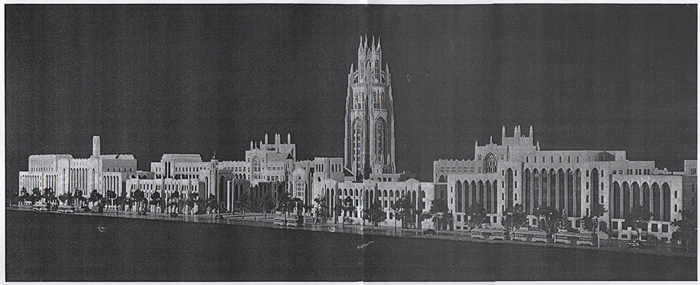
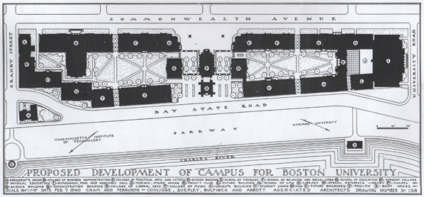
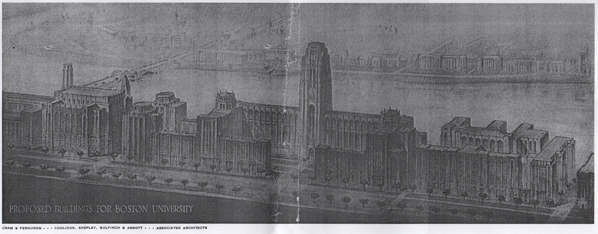
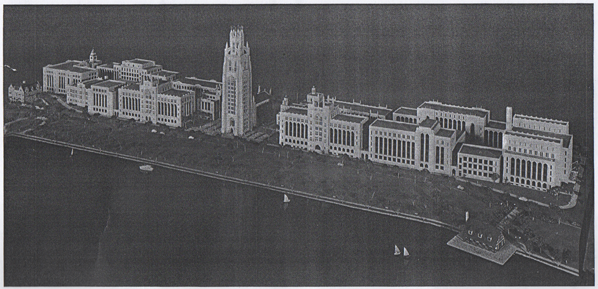

Originally published on <a href="http://buquad.com/?p=37806">The Quad</a>.

A ghost haunts central campus. The copper-plated specter hangs above the doorways to the School of Theology and the College of Arts and Sciences. Recalling the ambitions of a young university, this phantom tower is the key to a campus that could have been.

The Alexander Graham Bell Memorial tower was meant to anchor Boston University's unified Charles River Campus. It would house the University's administrative offices and graduate school and cost a million dollars. The tower's real value, however, was in its rich symbolism. Named for Alexander Graham Bell, who invented the telephone while on the school's faculty, it would reify the school's pride and anticipate a brighter future.  It would cast long shadows over MIT and Harvard from across the Charles and forever alter Boston's skyline, symbolically integrating the University with its city. It would also establish a trans-Atlantic connection with Boston, England, uniting the two cities with [twin towers](http://en.wikipedia.org/wiki/Boston_Stump). The tower would rise from a brand new campus, unifying the school into an eminent whole.

Although Boston University was chartered in 1869, the Charles River Campus was not opened until 1938. Before the establishment of the riverside campus, the University's different departments and schools were scattered across the city. The School of Law neighbored the State House, the School of Theology sat a few blocks west on Mount Vernon Street, and clustered at Copley Square were the administrative buildings and School of Liberal Arts. The school's wide distribution became increasingly problematic as enrollment grew.

The interwar period was explosive for Boston University. In 1915, the school's enrollment was 2,060. Five years later it tripled to 6,795 students. The huge student body overwhelmed the older buildings. And, with students spread across central Boston, the school lacked unity and a cohesive campus culture. In 1920 the University purchased 15 acres of riverside property. From it would rise a grand campus. Planners and architects were consulted; the October 24, 1928 edition of the Boston University News reported on the final design presented to the University's Board of Trustees. By that time the school's population had again doubled to around 14,000 students and its facilities were overwhelmed.[^1] As compensation, "the new buildings [were] designed…for almost double the present enrollment of the university," a pragmatic precaution considering today's enrollment: 31,766 students.[^2] Multi-story departmental buildings containing offices, laboratories, and classrooms would encircle campus quadrangles. A magnificent tower would crown the new campus along the Charles.

Obviously, this grand campus was never built. A 2007 historical account published by Boston University explained it was "forced to scale back its plans in the late '20s [because] the State Metropolitan District Commission used the right of eminent domain to claim the land nearest the river for the construction of Storrow Drive".[^3] Yet the pre-WWII highway was never built due to public protest. Storrow Drive wasn't constructed until after the second World War to address traffic problems arising from increasing suburbanization.[^4] Furthermore, the plans of 1928 clearly show the campus bounded by Bay State Road; none of the proposed structures would have intruded upon state property. The University's explanation for the failed construction of the Alexander Graham Bell Tower does not make sense. It is unlikely that the proposed 1920's Charles River Parkway disrupted construction. What was the real obstacle?

A likely explanation is found in the publication date of the Boston University News article: October 24, 1928. Exactly one year later came Black Monday and the Great Crash. I haven't discovered how the depression directly affected the University's finances. I do know the grand plans for campus rode along a wave of excess and easy credit. I do know that with the economic implosion, enrollment dropped precipitously and resulted in a period of severe austerity for the University. This, much more than an unbuilt highway, seems the most likely reason for postponing construction of the Charles River Campus and abandoning the Alexander Graham Bell Tower.

Although the tower was never built, it has an obvious contemporary analog. The construction of the John Hancock Student Village was another monumental undertaking for the University. The construction of Student Village Phase II (StuVi2), a 26-story steel skyscraper, was another architectural imposition upon Boston's skyline. Construction of a third tower (StuVi3) was halted due to the 2008 crash and recession. Another display of BU's prominence that rode another wave of excess and easy credit, the Student Village is a spiritual sibling to the unbuilt tower.

Campus construction has made the 1920's master plan obsolete. The campus is still decentralized; it is a mile-long riverside strip instead of a densely packed complex. Still, remnants of BU's past are scattered throughout campus. Scraping away the layers of history reveal the idealism and ambition of a university at the start of the twentieth century. By comparing the campus that is to the campus that could have been, we can better understand the ambitions of the school we call home.

_I would like to thank the Howard Gottlieb Archival Research Center for free access to their materials and assistance. All images belong to the Howard Gottlieb Archival Research Center and may not be republished without their explicit consent._

[^1]: "Trustees View New Campus Plans." Boston University News 24 Oct. 1928. Print.
[^2]: "Boston University." Wikipedia. Wikimedia Foundation. Web. 28 Apr. 2012. <http://en.wikipedia.org/wiki/Boston_University>.
[^3]: "Between the World Wars." _History_. Boston University. Web. 28 Apr. 2012. <http://web.archive.org/web/20071212022404/http://www.bu.edu/visit/about/history/betweenwars.html>.
[^4]: Seasholes, Nancy S. "Storrow Drive." _Gaining Ground: A History of Landmaking in Boston_. Cambridge, MA: MIT, 2003. 206. Print.
