<ol class="toc">Table of Contents
<li><a href="#section:intro">Introduction</a></li>
<li><a href="#section:park">The Park</a></li>
<li><a href="#section:overpass">The Overpass</a></li>
<li><a href="#section:perspectives">Perspectives</a></li>
<li><a href="#section:conclusions">Conclusions</a></li>
<li><a href="#section:footer">References</a></li>
</ol>

<aside>This essay has been recognized by the Eastern American Studies Association and <a href="http://harrisburg.psu.edu/sites/default/files/eastern-american-studies-association/newerrandsoct3020130.pdf" title="New Errands Issue 1, Volume 1">published in New Errands</a>, their journal of distinguished undergraduate research.</aside>

<figure class="quote" id="section:intro">
<blockquote>Not only are we allowing individuals to destroy a naturally beautiful landscape, but we are by default allowing these same or other individuals to replace or deface it with ugliness of an anti-human dimension.</blockquote>
<figcaption>Richard Latham, <cite>The Artifact as a Cultural Cipher</cite></figcaption>
</figure>

Between Boston&#8217;s Back Bay and Kenmore neighborhoods, a small stretch of parkland branches off from the Charles River. This park, once a salty bog, was transformed into a tranquil urban oasis: Charlesgate Park. Today it is again a wasteland, albeit one capped by a highway overpass.

Charlesgate Park, throughout its century-long lifespan, was simply a small slice of green through Boston. It had grassy fields; a tranquil, grassy river; and plenty of reeds, shrubs, and trees. It provided residents an escape from the dirt, concrete, and artifice of the city. The first architectural imposition upon the landscape, Charlesgate Park was representative of the values held by urban planners in the earliest years of the twentieth century.

The Bowker Overpass was an ordinary stretch of elevated highway. However it was an unconventional instance of urban highway development. Its construction required no demolition or relocation of residents. It did not invade a minority neighborhood or introduce questions of eminent domain. The overpass was not even constructed on bought land. It was built upon the cheapest land possible, city owned land, which benefitted both taxpayers and politicians. To the planners of the 1960s, the parkland was entirely dispensable.

The small, rectangular plot between Kenmore and Back Bay has experienced multiple iterations since its initial development. The dominant urban design theories of multiple eras imposed themselves upon it. Currently the landscape is in dire disrepair, but looking beyond the developments of later decades reveals a rich heritage. Before the highway, what was the relationship between the parkland and the city? Was the land so valueless as to have no protection against disruptive development? What has happened to the landscape after the overpass&#8217;s construction; was value added?

This paper does not lament the loss of a park; it has been replaced by a highway and the past is immutable. Instead, this paper will examine the transformation of the landscape over time. It paper will analyze the landscape by tracing its history, observing it, identifying the ambitions that guided its development, and finding the realistic limits of those ambitions.<a href="#fn:1" rel="footnote">1</a> This is a study of how a landscape is an expression of the society surrounding it.

<figure class="image">
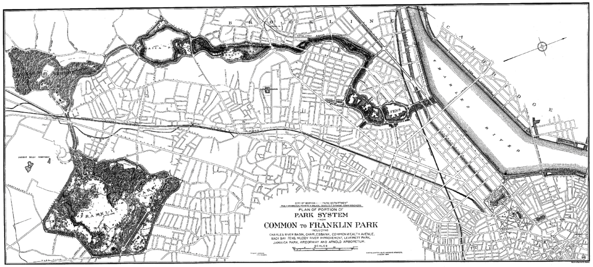
<figcaption><strong>Fig. 1</strong> Olmsted’s master plan for Boston’s Emerald Necklace. List of parks, clockwise from bottom: Franklin Park, Arnold Arboretum, Jamaica Park, Riverway, Back Bay Fens, Charlesgate Park, Commonwealth Avenue Mall, Boston Garden, Boston Common.</figcaption>
</figure>

The twentieth century was dominated by three distinct periods of urban planning and design. The first, leading into 1900, was influenced by transcendentalism. It sought to replace a natural beauty destroyed by industry and commerce. The second, following the end of World War II, was focused upon the automobile and suburban development. The third, emerging in the early 1960s, treasured urban neighborhoods and refocused on residents.

Frederick Law Olmsted was the co-leader of the first period, along with Andrew Jackson Downing. Robert Moses was not the leader of the second period, but he was its preeminent practitioner. The third wave of urban design theory emerged from criticisms of Moses and the second wave. Led by Jane Jacobs, this school of thought carries into the present and will have inevitable effects upon the landscapes of tomorrow.

Frederick Law Olmsted rooted the theoretical basis for his parks in his aesthetic ideals. The artifice of the urban landscape was human; the natural world was connected to God. There was a danger, Olmsted felt, that those in the city may lose their relationship with God. In all the parks he designed:

<blockquote>Olmsted&#8217;s most important objective was to use the park to restore the alienated city inhabitants a sense of community and to the fragmented psyche a sense of wholeness. In Olmsted&#8217;s view the park was an aesthetic instrument to achieve a social and psychological change in a business oriented, urban society.<a href="#fn:2" rel="footnote">2</a></blockquote>

His parks aspired to spiritual restoration and communication of the sublime beauty of nature. Olmsted idealized nature: instead of recreating natural landscapes as they were, he created natural landscapes as they ought to appear. Men and women were meant to lounge in the park while pondering their relationship to the grass and trees. Olmsted&#8217;s ambitions were communicated through his carefully designed plans his own blatant explanation.

Robert Moses was New York City&#8217;s infamous master builder. Imposing his will upon the city, shaped it as he saw fit. He leveled historic neighborhoods and cut off Manhattan from its riverfront with his extensive highway networks. He also created much of the Long Island suburban sprawl by building bridges and highways leading straight into the city. The size of his ambition was only matched by the size of his engineering projects. It was this ambition which would eventually be his undoing.

In 1961, concurrent with the planning and construction of the Bowker Overpass, Moses was pushing for approval of the Lower Manhattan Expressway (<acronym title="Lower Manhattan Expressway">LOMEX</acronym>). The federally funded, elevated highway would begin at the Manhattan exit of the Holland Tunnel and cut across the island&#8217;s south end, severing it from the rest of the city. It would fork halfway, one prong headed towards the Manhattan Bridge and the other towards the Williamsburg Bridge, further sectioning the island. The construction would bulldoze through countless blocks of low-income housing in Little Italy and SoHo—Moses did not care what was lost, only that his highway be built.

Opposition to <acronym title="Lower Manhattan Expressway">LOMEX</acronym> was spearheaded by Jane Jacobs, an architectural journalist. Jacobs first got interested in cities as a way of defending Greenwich Village, her neighborhood. At the time, these small-scale enclaves were under constant attack as city planers sought to &#8220;modernize&#8221; the civic landscape, bulldozing old buildings and erecting &#8220;super-blocks&#8221; filled with residential high-rises and elevated highways.<a href="#fn:3" rel="footnote">3</a> She lead a popular campaign against Moses and his project; gathering public opinion, she helped prevent its approval. Moses&#8217;s ideology, placing the automobile as the fundamental urban unit, was supplemented by Jacob&#8217;s, which understood people to be essential.

<figure class="image">
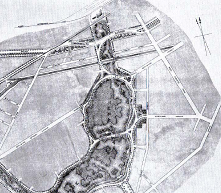
<figcaption><strong>Fig. 2</strong> 1887 design for the Back Bay Fens and Charlesgate Park. The park is the tall rectangle at the top of the image. Running through Charlesgate Park is Commonwealth Avenue. Running between Charlesgate Park and the Fens is the Boston &amp; Albany Railroad. The Charles River (not pictured) is directly north of this map.</figcaption>
</figure>

Moreover, Jacobs thought neighborhoods and small-scale interactions were far more important to cities than Moses&#8217; grand, dehumanizing designs. She believed that, &#8220;the more successfully a city mingles everyday diversity of uses and users in its everyday streets, the more successfully, casually (and economically) its people thereby enliven and support well-located parks that can thus give back grace and delight to their neighborhoods instead of vacuity.&#8221;<a href="#fn:4" rel="footnote">4</a> Jacobs&#8217; urban planning is rooted in an understanding of the communities that fill a city, and designing in accordance with their needs and behaviors. If this seems a return to Olmsted&#8217;s ideals, it is, but with modifications. Jacobs presents preservation and historical awareness as essential, reducing new building until it is only needed to replace the ones that fall. She still understands individuals to be the functional unit of the city, guiding its growth, just as Olmsted did. Yet, she has also been touched by Moses&#8217;s influence and she still believes in large-scale, systematic planning of cities.

Each of these three periods has manifested itself upon the landscape as American society changed and the landscape was transformed to meet changing needs. The small plot of land between Kenmore and Back Bay chronicles urban development over the course of the twentieth century.

<h3 id="section:park">The Park</h3>
<h3 class="subheader">1870s – 1900s</h3>

In the late 1870s, Olmsted was hired to design a new park system for the city of Boston. One of the many linear, urban park networks he designed, it was named Boston&#8217;s Emerald Necklace. Olmsted&#8217;s system began in downtown Boston and ran out into its peripheral suburban areas. The planned system was seven miles long, and ran though multiple neighborhoods and districts.  The system began in the Boston Common, ran westward down the Commonwealth Avenue Mall, turned south at the Back Bay Fens, followed the Muddy River south towards the Arboretum, and finally turned back east to end in Franklin Park. Each park was a jewel along a semicircular string.

One of these jewels was Charlesgate Park, sited on the small strip of land between Back Bay and Kenmore. Before the area was developed into a park it was a collection of swampy, brackish pools connected to the Atlantic tides. The landscape&#8217;s transformation into a park formalized the boundary between Back Bay and Kenmore while addressing several essential environmental needs.

Olmsted&#8217;s design for the park addressed three problems: controlling flooding, correcting the unhealthy conditions caused by salt water, and beautification. The first two problems did not require Olmsted&#8217;s expertise—they could be solved by any engineer<a href="#fn:5" rel="footnote">5</a>. The beautification of the swampy area, however, required his careful consideration. For the residents of Back Bay he was determined to preserve some elements of a landscape that Boston was devouring as its boundaries grew. He also hoped to help preserve some sanity for the Back Bay&#8217;s residents, afraid that the sheer artifice of the cityscape would overwhelm residents.

Olmsted would return to the landscape a sublime sense of natural beauty. He wanted to restore plant and animal life to an area stripped bare by human activity. His plan for Charlesgate Park focused upon the:

<blockquote>direct development of the original conditions of the locality in adaptation to the needs of a dense community. So regarded, it will be found to be, in the artistic sense of the word, natural, and possible to suggest a modest poetic sentiment more grateful to town-weary minds than an elaborate and elegant gardenlike work would have yielded.<a href="#fn:6" rel="footnote">6</a></blockquote>

The &#8220;natural, and…modest poetic sentiment&#8221; would express itself through curvilinear forms, organized plantings of indigenous greenery, and a meandering river. The birdsong in trees and the quiet babbling of the river would put weary minds to rest, minds frayed by the bustle of a major city. The natural landscape Olmsted planned would be a paradise, free from artifice and the eroding forces of civilization.

There was an uneasy cohabitation between the park and the city. The landscape, however natural in appearances, still belonged to Boston and the park could never completely separate itself from the city. It had to integrate itself into the urban fabric. Olmsted planned for &#8220;the park and the city [to] remain a complementary duality, yet synthesized into an organic urban whole for the community.&#8221; He provided stark contrast against the urban order, since &#8220;the configuration of the park, with its free-flowing, natural lines, was the antithesis of the gridiron design of the city.&#8221;<a href="#fn:7" rel="footnote">7</a> The lines, however free-flowing, were still engineered by Olmsted. The design of the park was a careful reconciliation between the natural and built environments. The rational design of Charlesgate Park imposed a layer of human control over the chaotic stochasticity of nature.

<figure class="image">
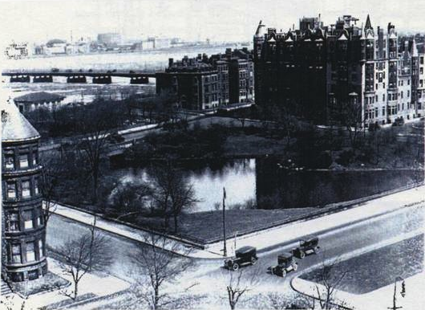
<figcaption><strong>Fig. 3</strong> Charlesgate Park in 1920, seen with the Charles River in the background.</figcaption>
</figure>
<figure class="image">
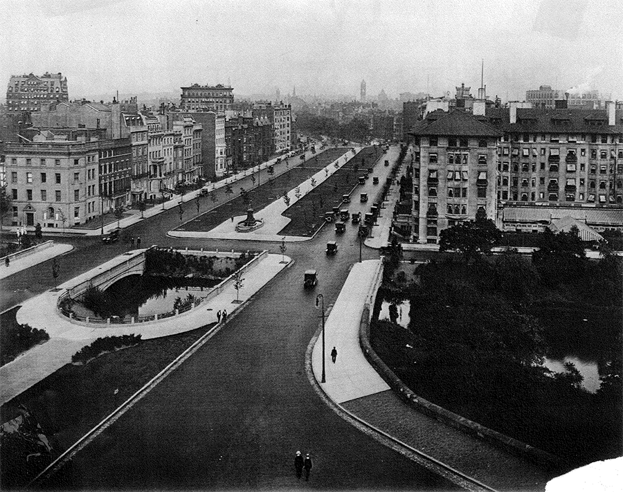
<figcaption><strong>Fig. 4</strong> Commonwealth Avenue, seen where it crossed Charlesgate Park.</figcaption>
</figure>

Where the city intruded upon the park, Olmsted, &#8220;subordinated the artificial and manmade objects to the vegetation.&#8221; He believed that, &#8220;to the extent that roads, bridges, walks, seats, and buildings must be constructed for the convenience of a mass of people, they detract from the aesthetic element of the park,&#8221; avoiding manmade elements only when necessary. When these features were necessary, Olmsted maintained that, &#8220;they must be subordinate and harmonious with the natural features. They must not conspicuously obtrude.&#8221;<a href="#fn:8" rel="footnote">8</a> Olmsted wanted to provide an escape from the city, but ignoring its presence would be obtuse. He had to accommodate urban forces or they would sunder his careful plan. Olmsted could not fight the forces of urbanization surrounding his park, so he did his best to reconcile with them.

The reconciliation between urban and natural elements is most obvious in Olmsted&#8217;s design for the Fenway, a parkway that ran around, and occasionally through, his park. It connected the northern riverfront to the suburbs further south. Adhering to his design philosophy, &#8220;Olmsted creatively attempted to incorporate the assets of natural beauty while providing the utility of a broad highway for the efficient flow of vehicular traffic.&#8221;<a href="#fn:9" rel="footnote">9</a> The Fenway surrounded and enclosed the Fens, buffering it from the city. The Fenway&#8217;s goals, utility and efficient flow, were oppositional to the tranquility and naturalism of the park, but still contained many of the park&#8217;s natural elements. The parkway created a transitional aesthetic space, a smooth gradient from the city&#8217;s stone and brick to the park&#8217;s trees and grass. This neatly integrated the park within the cityscape.

The Fens ended at the south of Charlesgate Park. To connect the Fenway to Commonwealth Avenue, Olmsted planned for a semicircular intersection to cap the fens; the semicircular design preserved as much parkland as possible. This junction crossed over the Boston &#38; Albany Railroad that separated Charlesgate Park from the Fenway. The parkway bridges crossing the railroad and the river were designed by acclaimed American architect and Olmsted&#8217;s friend H.H. Richardson. "In the Fenway bridge there is plainly visible the organic beauty-function aesthetic" which aligns perfectly with Olmsted&#8217;s aesthetic goals since "Richardson had early established the practice of using local materials so that his buildings would be congruent with their surroundings."<a href="#fn:10" rel="footnote">10</a> The bridge crossing the river was built from locally quarried puddingstone and the one crossing the railway was built from steel. The river bridge recalled the simplicity of rural Massachusetts while the railway bridge mimicked the mathematical precision of industrial construction. Despite different styles, their underlying design remained the same and bridged the aesthetic distance between the two.

Olmsted&#8217;s design for Charlesgate Park and all its trappings was reflective of the society he belonged to. There was a real fear, at the dawn of the twentieth century, that the overwhelming artifice of the city would be detrimental to the human spirit. With more families leaving their homesteads for the big cities, a connection to the natural world, and by extension God, was becoming severed. Olmsted meant to mitigate these fears with his parks, reintroducing natural features into the urban fabric.

Olmsted planned for traffic, but he did not predict the growing popularity of the automobile among Boston&#8217;s middle class as the twentieth century progressed. Cars were increasingly preferred to public transportation and Boston&#8217;s network of low-density roadways soon became congested with commuter traffic.

<h3 id="section:overpass">The Overpass</h3>
<h3 class="subheader">1920s – 1960s</h3>

As roadways became increasingly choked with traffic, Boston politicians began to hunt for solutions. One of these was a redesign of the intersection at the south end of Charlesgate Park proposed in 1929. On February 27, 1929, the Boston Globe reported on Mayor Nichols&#8217; proposal to relive cross traffic in Kenmore Square.<a href="#fn:11" rel="footnote">11</a> The planned development would demolish Richardson&#8217;s railway bridge, replacing it with a higher capacity overpass. Starting at Gaston Square and stretching north, the new roadway would stand above Charlesgate Park, Commonwealth Avenue, and Beacon Street, carrying traffic towards a planned Charles River parkway. If constructed, the overpass would have forced Charlesgate Park and its patrons to pay for the city&#8217;s poor planning. It was never enacted and fell by the wayside. Yet, the idea had potential. This proposal was essentially identical to the overpass constructed a full three decades later. For the next few decades an overpass through Charlesgate Park was the immediate solution to complaints against Kenmore Square&#8217;s traffic.

<figure class="image">
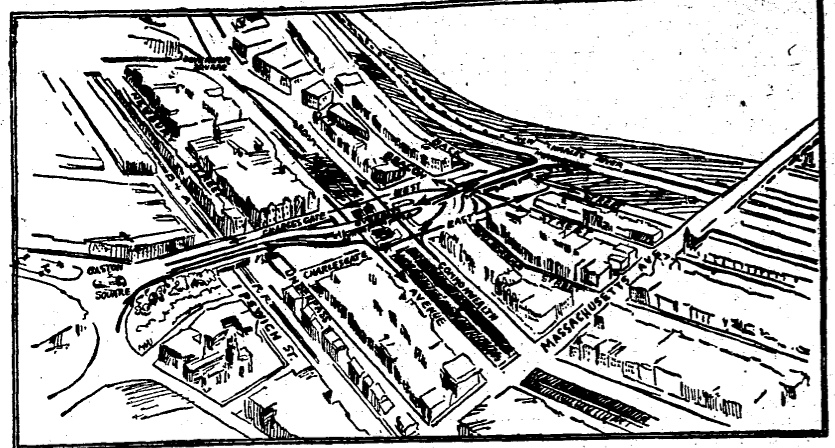
<figcaption><strong>Fig. 5</strong> An illustration of the 1929 overpass proposal.</figcaption>
</figure>
<figure class="image">
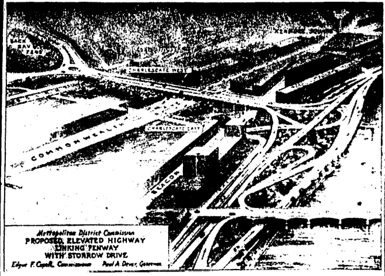
<figcaption><strong>Fig. 6</strong> An illustration of the 1952 overpass proposal; notice the enlarged intersection.</figcaption>
</figure>

In 1952, an overpass over Charlesgate Park was proposed again<a href="#fn:12" rel="footnote">12</a> and its updated design was greedier than the one from 1929—it would consume almost the entirety of Charlesgate Park. The updated overpass would branch out of Gaston Square and rise 14 feet above the park, passing over the railway, Commonwealth Avenue, and Beacon Street. It would end in a T-intersection with Storrow Drive, allowing high-speed entry and exit without traffic signals. The branching, sloping on- and off-ramps would require much more space than the 1929 design, consuming the entire north end of the park between Beacon and Commonwealth. Additionally, the overpass was wider and would have to cut through a large section of the park.

The 1952 overpass design was not built, either. The Metropolitan District Commission (<acronym title="Metropolitan District Comission">MDC</acronym>) blamed this upon rising construction costs for Storrow Drive and timidity over interference with Massachusetts Turnpike planning. Poor communication between different state planning agencies seemed to have spared the park—but not for long.

Boston&#8217;s postwar planners and politicians were untroubled by repurposing parkland into highways. The construction of the Storrow Drive parkway set a precedent which would later be followed by the Bowker Overpass. Storrow Drive was built in response to suburbanization after World War II, which drastically increased the volume of automotive commuters. The parkway consumed a large portion of the riverside esplanade that ran the length of the Charles River Basin. Despite enormous opposition, "the highway proposal was…rammed through the [state] legislature."<a href="#fn:13" rel="footnote">13</a> Politicians worked against residents, feeling the highway&#8217;s benefits justified their actions. The willingness of the city and state governments to build upon parkland was reflective of the contemporary mindset, where cars were king and the commuters were first-class citizens.

Storrow Drive became popular for commuters—it began to overflow with traffic and threaten the surrounding roadways. Storrow Drive was so popular since it substantially eased travel between the riverside suburbs and the city. Without police enforcement, the 35 mile-per-hour parkway speed limit was disregarded, unofficially transforming the route into a major highway. With increased speeds came decreased commute times; with decreased commute times came increased volumes. Soon Storrow Drive was beyond capacity and the gridlock spilled over onto adjacent roadways. Kenmore Square suffered heavy congestion during rush hours. The backstreet connections between one major traffic artery, Storrow Drive, and another, the Fenway, were quickly overwhelmed. The speed and mass of commuters was destructive and dangerous for all residents.

In 1962, Robert Carr reported in his Boston Globe transportation column about an effort by the Metropolitan District Commission to revive the 1952 overpass<a href="#fn:14" rel="footnote">14</a>. Carr condemned the heavy traffic in his series on inefficient intersections and areas of improvement within the road network. Kenmore Square was a disaster and authorities within the <acronym title="Metropolitan District Comission">MDC</acronym> began to publicly call for funds to build the overpass. Carr was a proponent of the project, extolling its virtues within his column. With loud public voices in their favor, the Metropolitan District Commission began to act.

A year later, in April of 1963, residents and business approved the <acronym title="Metropolitan District Comission">MDC</acronym>&#8217;s overpass proposal. It initially required an allocation of 3.5 million dollars, part of which was offset by the Massachusetts Turnpike Authority<a href="#fn:15" rel="footnote">15</a>. The assistance from the Turnpike Authority came with a stipulation: Richardson&#8217;s railway bridge would be demolished to widen the roadbed, enabling construction of the new turnpike into Boston. Charlesgate Park was losing ground on all sides: to the north for the Storrow Drive intersection, to the south for the turnpike expansion, and straight through the middle for the overpass. The construction of the overpass and the turnpike upon former parkland evidences the revaluation of open space and public parkland in the face of a growing national infrastructure. Open space became wasted space, free to be built up with asphalt and off-ramps.

With the changes made to the landscape, the Metropolitan District Commission finally wrested control from Olmsted. The overpass opened on December 17, 1965. In October of 1966, it was dedicated to Brookline state senator and former <acronym title="Metropolitan District Comission">MDC</acronym> commissioner Philip G. Bowker. To appease the residents of the overpass’s neighborhood, the <acronym title="Metropolitan District Comission">MDC</acronym> "went much further than merely replacing the previous shabby greenery in the old park," according to one Boston Globe article. The Commission renovated the park below, and added, "brick walks, sculptured concrete benches, attractive pole lights; plus hardy Austrian pines, shrubs, bushes, and automatic sprinklers—and expanses of pachysandra plants, 340,000 of them."<a href="#fn:16" rel="footnote">16</a> With large pines and concrete furniture, not to mention the imposing steel structure, the <acronym title="Metropolitan District Comission">MDC</acronym> permanently changed the character of the park.

During planning and construction, a society&#8217;s ideals are made manifest upon the environment. The demand for development and the allocation of space are dependent on what the society values at that moment. When Olmsted took undeveloped land and transformed it into a park, he was serving his society. When planners at the <acronym title="Metropolitan District Comission">MDC</acronym> took Olmsted&#8217;s park and transformed it into an overpass and highway extension, they were serving their society. Once construction ends, however, and the landscape is left to sit, it continues to develop. As the society surrounding it changes and uses the landscape differently, it responds to those changes.

In theory, there were no barriers to Olmsted&#8217;s park. All were welcome to enjoy the area and participate in the adoration of nature. Practically, access to the park was limited, mostly by class privileges. Charlesgate Park was located by the Back Bay, a wealthy neighborhood considerably distant from poorer areas of the city. Additionally, there is a question of whether Boston&#8217;s poor could afford the luxury of long walks and quiet relaxation the park encouraged. Other Olmsted parks around Boston, especially Franklin Park, were located farther out from the city and better located for the poor. It seems as though Charlesgate Park and the Back Bay Fens were much less inclusive than intended.

With the construction of the Bowker Overpass, the scale of the Charlesgate landscape ballooned, unexpectedly excluding all people from the area. It creates a landscape that, according to designer Richard Latham, is, "too big by human standards." It is simply, "too large in relation to the human beings who…live with it."<a href="#fn:17" rel="footnote">17</a> The overpass is disproportionate to the human scale creating a feeling of displacement and alienation within the landscape. It excludes people by providing them no place within the developed landscape.

The overpass&#8217;s dedication to needs of the car, above all other occupants of the landscape, results in this exclusionary scale. Boris Pushkarev, former Chief Planner with the Regional Plan Association of New York, understands, “the scale of the urban environment [to be], of course, a function of the prevailing technological level, which is reflected in, among other things, the consumption of energy by a society…Our consumption of raw mechanical energy in 1960 was over sixty times greater than that of energy supplied through food.”<a href="#fn:18" rel="footnote">18</a> Cars were faster and heavier than anything that existed in Olmsted&#8217;s time, save for the locomotive. The automobile, when introduced to the Charlesgate Park landscape, overwhelmed it. The only way the landscape could safely contain the cars was with a massive overpass, looming above pedestrians. The size of the overpass did not appeal to the needs of humans, but those of automobiles.

The design and construction of the Bowker Overpass was dictated by one particular set of needs: those of cars. Thousands of multi-ton cars cross the overpass every day; it must be able to support the weight. It is wide enough—with room to spare—to provide buffer space between cars, the overpass&#8217;s edges, and oncoming traffic. The structure must also accommodate high-speed traffic for automobiles exiting and entering Storrow Drive. A single traffic accident could shut the overpass down and bottleneck Storrow Drive, leading to greater danger. The park&#8217;s thick concrete pylons and latticed steel framework prevent it from collapsing. The on- and off-ramps gently slope, with wide turns as a precaution against high-speed fatalities. The underside of the structure is raw and unembellished, while the topside, the roadside, is smooth, adorned with signs, and well lit at night. The structure itself reveals its society&#8217;s prioritization of cars and devaluation of individuals.

The park and the overpass addressed the needs of different segments of Boston&#8217;s population. The engineering and design targeted the problems of specific groups. This means however well a park or overpass may have solved certain issues, the lack of any all-encompassing solution has engaged a territorial dispute between population subsets. Residents demand a people-focused environment, while drivers demand an automobile-focused one. Olmsted understood people, individuals, as the fundamental unit of a city. The overpass saw the automobile as the fundamental unit. When the road ran over the park, these two ideas were irreconcilable. Only one philosophy could exist within the space, and the overpass won. That tension is, today, still manifested upon the landscape.

<h3 id="section:perspectives">Perspectives</h3>
<h3 class="subheader">Present Day</h3>

Today, the landscape can be understood in different ways. To visit the park as a pedestrian, observing it at eye level, is only one method of understanding the landscape. It is a fragmented method with a tendency to separate out specific elements from the larger whole, as passage throughout the space is required. Most of the observations are subjective, sensory, and lack rationality. Grounded observations carry very particular, unprovable claims along with them. These claims must be offset by another, more objective, perspective. Seen through maps, the landscape as seen from above—as a planner might—affords a better view of the complex systems operating within the landscape.

Charlesgate Park once served as a barrier between the Back Bay and Kenmore Square. Today, the Bowker Overpass achieves the same effect. A singular mass of steel and concrete, it has a distinct lack of aesthetic sense. The actual structure is cut-rate, without any of the careful design and environmental considerations present in the Richardson bridge it replaced. Construction crews dropped massive concrete pylons into the river and upon lawns. They erected large stone walls along an east-west axis, cutting off any potential views of the Charles River. It seems as if the structure was dropped on the park from above, with no concern for geography or precision.

Since its construction the park has been completely subsumed by the overpass. Where there was once a picturesque urban oasis is now a dry and dying husk. A park designed for the appreciation of natural beauty and the release from industrial and commercial blight has disappeared. Despite the extensive planting by the <acronym title="Metropolitan District Comission">MDC</acronym>, the landscape has been uncared for far too long. It has become an urban wasteland, ignored and abandoned by the very people it was built to serve. The overpass has overwhelmed the landscape and obliterated Olmsted&#8217;s careful environmental planning.

Where Olmsted&#8217;s classical Commonwealth Avenue bridges crossed the small river, they were flanked by crude barriers of iron piping, carelessly built and never replaced or improved. The railings were built to prevent anyone from falling into an increasingly garbage choked river. The river, once the treasure of Olmsted&#8217;s park, is heartbreaking in its current state.

Once grassy lawns are now unmaintained. They turn to dirt and, when it rains, muck. When overpass maintenance crews drive upon the soggy lawns to repair leaks in the roadway, they carve deep gouges into the ground. Runoff water collects into these ruts and putrefies.

The lattice steel canopy has become a pigeon roost and passersby were constantly blighted by fecal rain until the city lined the overpass&#8217;s underside with a protective layer of two by fours. There are dangers underfoot as well, as geese have laid a minefield of their own feces. The overpass blocks out the noon sun, the only direct light the park receives. The landscape is dark and decaying, inhospitable to the individuals who pass through it.

Equally inhospitable is the top of the overpass, the space reserved for cars. Pedestrians are not allowed on the roadway, save for one sidewalk running up an offramp and providing a footbridge over the Turnpike. To take this path is to subject oneself to an even more threatening atmosphere than the desolate parkland. Cars race by, an arms-length away. The surface of the overpass is solid concrete and the noon sun is turned full force upon its roadway. This was an area never meant for pedestrians. It begrudgingly accommodates the local community.

<figure class="image">
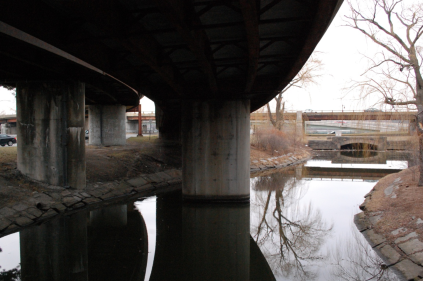
<figcaption><strong>Fig. 7</strong> </figcaption>
</figure>
<figure class="image">
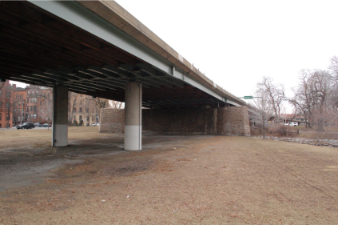
<figcaption><strong>Fig. 8</strong> </figcaption>
</figure>
<figure class="image">
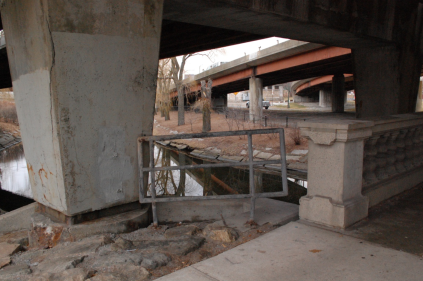
<figcaption><strong>Fig. 9</strong> </figcaption>
</figure>
<figure class="image">
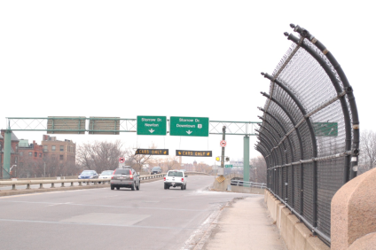
<figcaption><strong>Fig. 10</strong> </figcaption>
</figure>
<figure class="image">
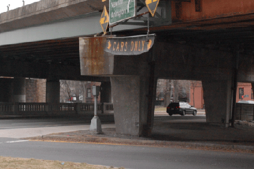
<figcaption><strong>Fig. 11</strong> </figcaption>
</figure>
<figure class="image">
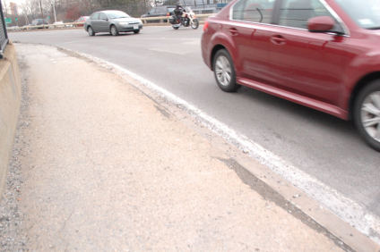
<figcaption><strong>Fig. 12</strong> </figcaption>
</figure>

The roadway oppresses the individual with the traffic&#8217;s unending drone. The sight of mutilated trees and desolate fields impress a bleak understanding of man&#8217;s subjugation of nature. The stagnant water banked by excrement is redolent of sewage. It is inhospitable, repulsive, and avoided by residents who do not enjoy being within its presence.

Taking the planners perspective, using maps and plans, allows one to see the landscape from above and enables another understanding. The aerial perspective allows the landscape to be viewed in its entirety. All elements are simultaneously and equally represented by the map. Spatial structure and organization emerge from what the pedestrian only sees as singular elements.

The Bowker Overpass plays a valuable role within Boston&#8217;s transportation infrastructure, a fact only visible from above. The overpass&#8217;s importance for suburban commuters is made obvious: it is a major intersection, providing nonstop highway access to every direction but north. The overpass&#8217;s relationship to its surrounding architecture is also better understood, with the structure neatly fitting between a gap in residential construction. Only from above do the snaking on- and off-ramps have any legibility, with in- and outbound traffic guided toward their directions as if riding along a track. At various scales, the planning perspective provides valuable insight into the landscape&#8217;s larger interactions.

The map, and by extension the planners perspective, is weakened by its detachment from the landscape. It is only a depiction of a real place and cannot accurately describe the landscape as it actually exists. It presents an illustration, useful for understanding the rational order of the space, but is ultimately an idealization.

The landscape&#8217;s documented representations in charts, plans, and proposals describes the ambitions held for the area and its ideal function and relationships. First-person observations inform us of the landscape&#8217;s actual functions and how the society has adapted the landscape to fit its own needs. Whether the original idealizations have survived or yielded to unanticipated forces is revealed by a comparison of the two.

The ambitions and actualities of Olmsted&#8217;s Charlesgate Park steadily diverged. Olmsted&#8217;s park was transformed due to the society&#8217;s need for easy automobile transportation to and from the suburbs. A need Olmsted could never have anticipated, his park could not accommodate it. In response the society captured his park and transformed it to fit their own needs. Underneath, the park still sits, but in starkly different circumstances than it was envisioned.

Storrow Drive was also transformed by its society, since they demanded a different use of it than its planners had intended. Ideally, Storrow Drive was a parkway for light traffic at low speeds. Today, its convenience for commuters and minimal police presence have transformed it into an unofficial expressway, with double the expected traffic traveling at speeds well above the limit. This discrepancy between its theoretical and actual uses had cascading consequences throughout the Boston&#8217;s riverside traffic networks, with high volumes of commuters snaking through unprepared side streets and intersections, like the one at Kenmore Square. The engineers of Storrow Drive had not foreseen this misuse of the roadway, and this caused the overpass&#8217;s construction.

The ambitions of the overpass most accurately satisfies its society. The overpass was envisioned as a relief for the congestion of Kenmore Square and as a quick, effortless interchange between Storrow Drive and the Fenway. It also had to carry cars across the railway and Massachusetts Turnpike. This is exactly how it is used by hundreds of thousands of commuters each day. The overpass is used just as it was intended.

Sometimes ambitions align with the realities of a landscape&#8217;s use—especially when it serves a small population whose needs are not expected to change. When they do not align, the landscape is transformed through the collective actions of its inhabitants. Understanding how landscapes responded to their occupants&#8217; needs formed the basis for the third major period in twentieth century urban design theory.

<h3 id="section:conclusions">Conclusions</h3>

The Bowker Overpass is almost 50 years old and, in the next few years, will either have to be rebuilt or demolished. This has sparked another debate within city planning meetings in the Back Bay. Two separate groups, the Esplanade Association and the Friends of Charlesgate Park, want the aging overpass torn down and the park preserved. Their arguments are bolstered by the contemporary attitudes towards urban design, the ones originating with Jane Jacobs.

The overpass, according to contemporary arguments, is an outdated and unseemly interruption of parkland and a detriment to the neighborhood. The Friends of the Charlesgate, who follow Jacobs&#8217; urban design theories, want the overpass should be torn down since it invades the neighborhood. They claim it favors the suburbanite, an "other," over the resident. They pine for a beautiful park in their backyards, one that respects Olmsted&#8217;s original vision for the area. The Esplanade Association, a separate group, wants the overpass torn down to remove the imposition it places upon the riverside Esplanade. They want the city-long strip of parkland to be preserved; part of that goal requires subduing Storrow Drive and reclaiming the land it stole. The Bowker Overpass, as a component of Storrow Drive, presents a threat to their vision.

The third wave of urban planning will layer itself upon the landscape in some way. If these organizations are ignored and the overpass is rebuilt, it will continue to support thick commuter traffic running in and out of the city. The parkland may be replanted, as it was in 1966, and the overpass&#8217;s aesthetics may be updated; Jacobs&#8217; influence will be felt, however lightly. Nevertheless, it will still be seen as a distasteful disservice to the people who surround it. If it is knocked down, it will signal a return to the urban planning of Olmsted and Jacobs, prioritizing residents over commuting transients. How deeply the third wave of urban planning theory will impress upon the landscape will be determined in just the next few years.

As each change was impressed upon this small strip of riverside land, it recorded its originating urban theory. These changes, layered and stacked as time progressed, provide a condensed history of urban design theory. From the transcendental theories of Frederick Law Olmsted, to the imposing infrastructural developments characteristic of Robert Moses&#8217; age, to the neighborhood-nurturing theories of Jane Jacobs, the landscape records them all. What makes Charlesgate Park remarkable is that these layers are not scraped away to make room for the newest; they all inhabit the landscape together, if not always equally.

Each of the landscape&#8217;s historical layers are not hidden—the park still rots under the rumbling overpass. It has, and will, serve as a record of the dominant design theories of the twentieth century. With a small bit of investigation and analysis, this landscape can divulge the relationships held between people and their cities, and how they changed over time.

<footer id="section:footer">
<h3>Footnotes</h3>
<ol>
<li id="fn:1">Analytic structure borrowed from Pierce Lewis, “Learning from Looking: Geographic and Other Writing about the American Cultural Landscape,” American Quarterly 35, no. 3 (1983).<a href="#fnref:1" rev="footnote">&#8617;</a></li>
<li id="fn:2">Irving Fisher, Frederick Law Olmsted and the City Planning Movement in the United States (Ann Arbor: UMI Research Press, 1986), 103.<a href="#fnref:2" rev="footnote">&#8617;</a></li>
<li id="fn:3">Jonah Lehrer, Imagine: How Creativity Works (Boston: Houghton Mifflin Harcourt, 2012), 180.<a href="#fnref:3" rev="footnote">&#8617;</a></li>
<li id="fn:4">Jane Jacobs, The Death and Life of Great American Cities (New York: Modern Library, 2011), 111.<a href="#fnref:4" rev="footnote">&#8617;</a></li>
<li id="fn:5">Fisher, Frederick Law Olmsted, 31.<a href="#fnref:5" rev="footnote">&#8617;</a></li>
<li id="fn:6">Board of Commissioners of the Department of Parks, City of Boston [Mass.] Annual Report 5 (1880), quoted in Irving Fisher, Frederick Law Olmsted and the City Planning Movement in the United States (Ann Arbor: UMI Research Press, 1986), 31.<a href="#fnref:6" rev="footnote">&#8617;</a></li>
<li id="fn:7">Fisher, Frederick Law Olmsted, 102–103.<a href="#fnref:7" rev="footnote">&#8617;</a></li>
<li id="fn:8">Fisher, Frederick Law Olmsted, 30–31.<a href="#fnref:8" rev="footnote">&#8617;</a></li>
<li id="fn:9">Fisher, Frederick Law Olmsted, 32.<a href="#fnref:9" rev="footnote">&#8617;</a></li>
<li id="fn:10">Fisher, Frederick Law Olmsted, 32.<a href="#fnref:10" rev="footnote">&#8617;</a></li>
<li id="fn:11">“Mayor Nichols Orders Plans For an Overpass to Eliminate Cross Traffic,” Boston Globe, February 27, 1929, 6.<a href="#fnref:11" rev="footnote">&#8617;</a></li>
<li id="fn:12">“New Arial Highway Coming,” Boston Globe, October 5, 1952, C48.<a href="#fnref:12" rev="footnote">&#8617;</a></li>
<li id="fn:13">Nancy S. Seasholes, “Storrow Drive,” in Gaining Ground: A History of Landmaking in Boston (Cambridge: MIT University Press, 2003), 206.<a href="#fnref:13" rev="footnote">&#8617;</a></li>
<li id="fn:14">Robert Carr, “250,000 Vehicles Crawl Through Each Day: Fens Overpass Called Must To Ease Kenmore Sq. Jam,” Boston Globe, January 7, 1962, B49.<a href="#fnref:14" rev="footnote">&#8617;</a></li>
<li id="fn:15">James Hammond, “Will Cost $3.5 Million: Residents Approve Charlesgate Bridge,” Boston Globe, March 2, 1963, 17.<a href="#fnref:15" rev="footnote">&#8617;</a></li>
<li id="fn:16">“New Back Bay Park,” Boston Globe, July 5, 1966, 8.<a href="#fnref:16" rev="footnote">&#8617;</a></li>
<li id="fn:17">Richard Latham, "The Artifact as a Cultural Cipher," in Who Designs America?, ed. Laurence Holland (Golden City: Anchor Books, 1966), 259.<a href="#fnref:17" rev="footnote">&#8617;</a></li>
<li id="fn:18">Boris Pushkarev, "Scale and Design in a New Environment," in Who Designs America?, ed. Laurence Holland (Golden City: Anchor Books, 1966), 94.<a href="#fnref:18" rev="footnote">&#8617;</a></li>
</ol>

<h3>Bibliography</h3>
<ul class="biblio">
<li>Board of Commissioners of the Department of Parks, City of Boston [Mass.]. Annual Report 5, 1880. Quoted in Irving Fisher. Frederick Law Olmsted and the City Planning Movement in the United States. Ann Arbor: UMI Research Press, 1986, 31.</li>
<li>Carr, Robert. “250,000 Vehicles Crawl Through Each Day: Fens Overpass Called Must To Ease Kenmore Sq. Jam.” Boston Globe, January 7, 1962, B49.</li>
<li>Fisher, Irving. Frederick Law Olmsted and the City Planning Movement in the United States. Ann Arbor: UMI Research Press, 1986.</li>
<li>Hammond, James. “Will Cost $3.5 Million: Residents Approve Charlesgate Bridge.” Boston Globe, March 2, 1963, 17.</li>
<li>Jacobs, Jane. The Death and Life of Great American Cities. New York: Modern Library, 2011.</li>
<li>Latham, Richard. "The Artifact as a Cultural Cipher." In Who Designs America?, edited by Laurence Holland, 257–80. Golden City: Anchor Books, 1966.</li>
<li>Lehrer, Jonah. Imagine: How Creativity Works. Boston: Houghton Mifflin Harcourt, 2012.</li>
<li>Lewis, Pierce. “Learning from Looking: Geographic and Other Writing about the American Cultural Landscape.” American Quarterly 35, no. 3 (1983): 242 - 61.</li>
<li>“Mayor Nichols Orders Plans For an Overpass to Eliminate Cross Traffic.” Boston Globe, February 27, 1929, 6.</li>
<li>“New Arial Highway Coming.” Boston Globe, October 5, 1952, C48.</li>
<li>“New Back Bay Park.” Boston Globe, July 5, 1966, 8.</li>
<li>Pushkarev, Boris. "Scale and Design in a New Environment." In Who Designs America?, edited by Laurence Holland, 86–119. Golden City: Anchor Books, 1966.</li>
<li>Seasholes, Nancy S. “Storrow Drive.” In Gaining Ground: A History of Landmaking in Boston, 206. Cambridge: MIT University Press, 2003.</li>
</ul>

<h3>Images</h3>
<ul>
<li><strong>Header</strong> Photograph by author</li>
<li id="fig:1"><strong>Fig. 1</strong> Boston Park Department & Olmsted Landscape Architects. Emerald Necklace Park System, Boston, Massachusetts. 1894. Illustration. Wikimedia Commons. <http://commons.wikimedia.org/wiki/File:Olmsted_historic_map_Boston.png>, accessed 25 April 2012. <a href="#figref:1">&#8617;</a></li>
<li id="fig:2"><strong>Fig. 2</strong> Boston Park Department & Olmsted Landscape Architects. Back Bay Fens, Boston, Massachusetts. 1887. Illustration. Wikimedia Commons. <http://commons.wikimedia.org/wiki/File:BackBayFens1887Plan.png>, accessed 25 April 2012. <a href="#figref:2">&#8617;</a></li>
<li id="fig:3"><strong>Fig. 3</strong> Jones, Leslie. View of Charlesgate Park. 1920. Photograph. <a href="http://charlesgateparkfriends.files.wordpress.com/2010/11/bowker1.jpg">Friends of the Charlesgate</a>, accessed 25 April 2012. <a href="#figref:3">&#8617;</a></li>
<li id="fig:4"><strong>Fig. 4</strong> Author Unknown. Untitled. Date Unknown. Photograph. <a href="http://charlesgateparkfriends.files.wordpress.com/2010/11/charlesgate.pdf">Friends of the Charlesgate</a>, accessed 25 April 2012. <a href="#figref:4">&#8617;</a></li>
<li id="fig:5"><strong>Fig. 5</strong> “Mayor Nichols Orders Plans For an Overpass to Eliminate Cross Traffic.” Boston Globe, February 27, 1929, 6. <a href="#figref:5">&#8617;</a></li>
<li id="fig:6"><strong>Fig. 6</strong> “New Arial Highway Coming.” Boston Globe, October 5, 1952, C48. <a href="#figref:6">&#8617;</a></li>
<li id="fig:7 fig:8 fig:9 fig:10 fig:11 fig:12"><strong>Fig. 7, 8, 9, 10, 11, 12</strong> Photographs by author <a href="#figref:7">&#8617;</a></li>
</ul>


