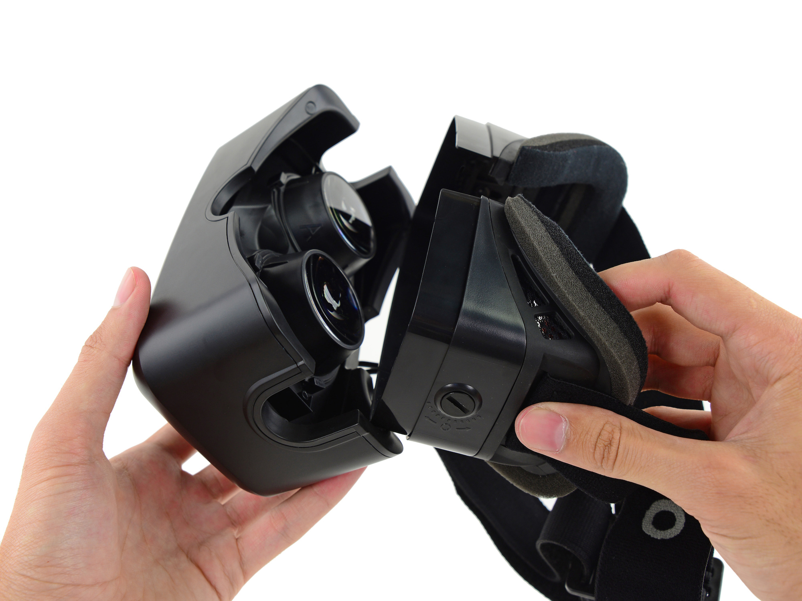
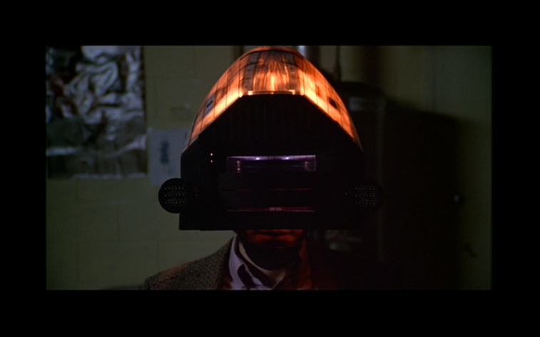
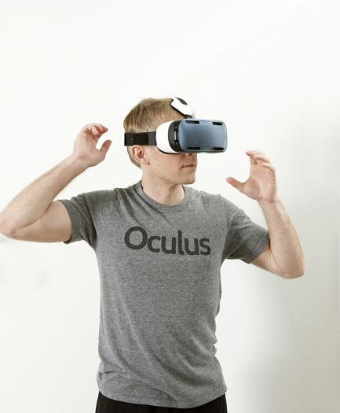
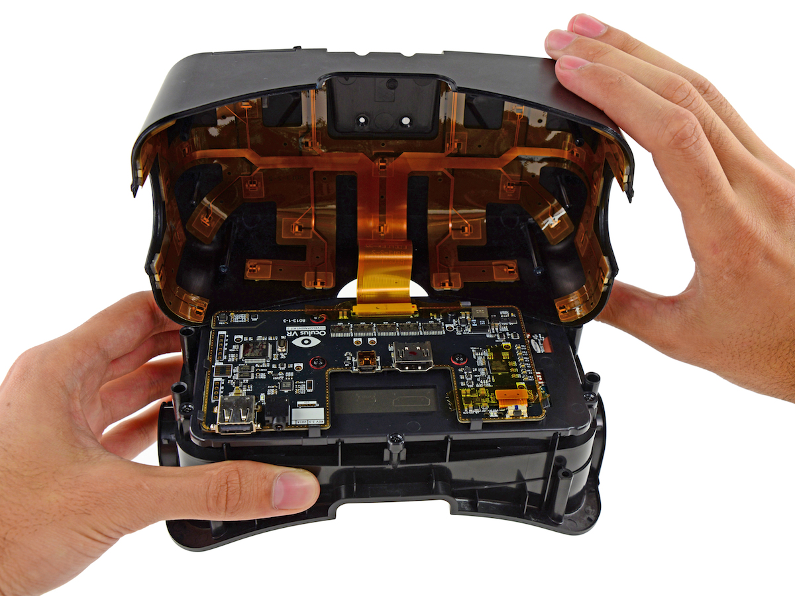

In March 2014, [Facebook acquired Oculus](https://www.facebook.com/zuck/posts/10101319050523971) for $2 billion (with a b!) dollars.
If you’ve been paying any attention to gaming over the last two years, then you’ll know about the Oculus Rift.
[Oculus](http://www.oculusvr.com/) is developing [the Rift](https://www.oculus.com/dk2/), a virtual reality headset.
The acquisition didn’t make much sense at the time.
Facebook isn't a video game company, why would it want a VR headset?
Well, both companies share a common vision: to deeply immerse us in digital worlds we can only experience from a distance today.
They both want to create _presence_, or the feeling that you’re the actually inhabiting a rendered world.
By understanding the Rift as a video game interface, we can get a better sense for its role as an interface to social media.

<figure>
  
  <figcaption>Cracking open the Rift. Image via <a href="https://www.ifixit.com/Guide/Image/meta/wMGJ2mABdvWtSKDB">Sam Lionheart</a> for <a href="https://www.ifixit.com/Teardown/Oculus+Rift+Development+Kit+2+Teardown/27613">ifixit</a>. Reproduced under <a href="http://creativecommons.org/licenses/by-nc-sa/3.0">Creative Commons BY-NC-SA</a>.</figcaption>
</figure>

Players have always been engaged in, but slightly removed from, the games they play.
Picture a game world.
It could be _Pac-Man’s_ 8-bit maze, the boxy biomes of _Minecraft_, the surreal Eagleland from _Earthbound_, or the hyperreal San Andreas of _Grand Theft Auto V_.
These imaginative worlds are navigated by equally interesting characters, controlled by players like marionettes.
Players can watch, care about, and interact with a virtual world.
They cannot enter into it.
Players are separated from their characters and the game world because the button-studded controller maps hardware inputs to virtual actions.
They’re not really looking, jumping, or acting like the character they control.
The controller abstracts the game’s complexity into a comprehensible number of inputs, but it also removes players from the world.
Still, controllers are only half the story: the player's distance from the game's output is equally important.

Virtual reality has always promised to shorten the distance between players and games by naturalizing output.
Technically, VR helmets sense their own orientation in space and control the view with their own software, the result being an in-game camera that looks where you're looking.
Essentially, VR tricks your brain into thinking that everything you're seeing is actually in front of you.
So far, VR has underwhelmed because [it's hard to trick somebody's brain like this without making them want to throw up](https://en.m.wikipedia.org/wiki/).
There's other problems besides motion sickness, including hardware that is either too heavy and uncomfortable or too expensive.

<figure>
    
    <figcaption>VR helmet from Videodrome. Image via <a href="https://ktismatics.wordpress.com/2008/02/03/videodrome-by-cronenberg-1983/">Ktismatics</a>. Reproduced under fair use.</figcaption>
</figure>

That is, until now.
The Oculus Rift is unique among virtual reality systems because it isn't half bad.
In fact, the Rift is responsive enough to allow for a feeling of presence to emerge.
When people wear the Rift for the first time, the experience is convincing enough to trick them into feeling like they can [_reach out and touch_](http://youtu.be/Ghgbycqb92c) the world they're seeing.
Presence signals that VR has made the necessary leap forward from research project to consumer product.
Once VR matures we'll probably look back on today's VR as a low-res hack.
We're headed towards strong presence, [which is the stuff of science fiction](https://en.m.wikipedia.org/wiki/Rainbows_End).
But just that we can create it at all is remarkable.

<figure>
    
    <figcaption>The most recent Rift, which is still in development. Image via <a href="https://twitter.com/oculus/status/571770120336384001">@oculus</a>. Reproduced under fair use.</figcaption>
</figure>

The Rift is so valuable to Facebook because it creates presence.
Facebook isn't a game world, but it is bound by many of the same rules.
We interact with our friends by typing up messages, snapping pictures, or recording videos.
We're not sharing experiences on Facebook, we're sharing recordings and memories of those experiences.
We’re taking action, but from a distance.
This distance is effectually similar to the one between players and characters in video games because it removes us from the experience.

With the advent of presence, Facebook can narrow this distance.
In his [letter announcing Facebook’s acquisition of Oculus](https://www.facebook.com/zuck/posts/10101319050523971), Mark Zuckerberg wrote:

> This is really a new communication platform. By feeling truly present, you can share unbounded spaces and experiences with the people in your life. Imagine sharing not just moments with your friends online, but entire experiences and adventures.

Presence allows Facebook and the rest of the social web to move beyond facilitating and enabling communication.
Essentially, it allows them to develop _their own form_ of communication.
So, no, Facebook is not a video game company.
But solving the problem of presence is as important to them as it is to video game companies.

<figure>
    
    <figcaption>A look inside the Rift. Image via <a href="https://www.ifixit.com/Guide/Image/meta/J6nl4bbTpAiDli5k">Miroslav Djuric</a> for <a href="https://www.ifixit.com/Teardown/Oculus+Rift+Development+Kit+2+Teardown/27613">ifixit</a>. Reproduced under <a href="http://creativecommons.org/licenses/by-nc-sa/3.0">Creative Commons BY-NC-SA</a>.</figcaption>
</figure>

Although it's the easiest scenario to expect, virtual reality will not turn social media into a video game.
There's a trope for this kind of prediction, involving [virtual chat rooms and blocky, poorly-animated 3D avatars of your friends](https://www.youtube.com/watch?v=XQLdhVpLBVE).
That's so wrong that it's silly.
We already have a place where you can hang out with friendly avatars: it’s called Second Life, and I don’t know a single person who uses it.
I do know, however, that Second Life has around 1 million active global users per month, [according to Second Life publisher Linden Labs](http://lindenlab.com/releases/infographic-10-years-of-second-life).
Facebook is three orders of magnitude larger than Second Life, with [1.32 billion (with a b!) monthly active users](http://newsroom.fb.com/company-info/).
Presence in social media will not be anything like hanging out with CG friends in CG shopping malls buying CG shirts and eating CG pretzels.

<figure>
    
    <figcaption>You will not be eating these inside of Facebook. Reproduced under fair use.</figcaption>
</figure>

Instead, the introduction of presence into social media will empower sharing. In an [interview with The Verge](http://www.theverge.com/a/virtual-reality/qa_fb), Cory Ondrejka,  VP of engineering at Facebook (and—get this—a _co-founder of Second Life_), explained his vision for Facebook’s technical evolution:

> Today, we capture places in a few ways.
> I can compress a space through text […] and you reproduce it in your head.
> I can take a photo that can be incredibly powerful, but it captures a singular moment or singular view.
> The next step is actually being able to capture all 360 degrees and depth and everything that’s going on.
> […]
> Bringing that through in VR is gonna be a much richer way to share my experience with my friends.

Facebook has already captured your personality, interests, and relationships.
Next it wants to capture the sum of your experiences—your singular experience—and use presence to help you (and your friends) navigate and relive it.

Think of all the memories we record and treasure now, and how they could be improved by presence.
Birthday parties, vacations, and quiet moments are the kinds of things we used to fill photo albums with.
They were the evidence of lives lived.
Imagine being able to go back and be there, inside those memories, just as you were.
And being able to afford the same opportunity to the friends and family who are shared those memories.
Sure, there's some trade-offs.[^1]
But there's also so many benefits, it'd be foolish to not try and realize them.

Facebook promises to be a window into the lives of your friends.
With the Rift, Facebook has the greatest window that’s ever been invented.
Achieving presence will empower Facebook to become a new medium, surpassing text, image, and video.
The closer Facebook comes to achieving presence, the closer they come to realizing a networked, social media.
Facebook would be not only deliver, but enable, intensely important and personal experiences.
With the Rift, Facebook becomes not only a window into your friends lives, but a window that you can open, stick your head through, and see what it feels like on the other side.

[^1]: e.g. _Black Mirror_ did an episode about a technology that allows total recall. Also, the movie _Total Recall_.
